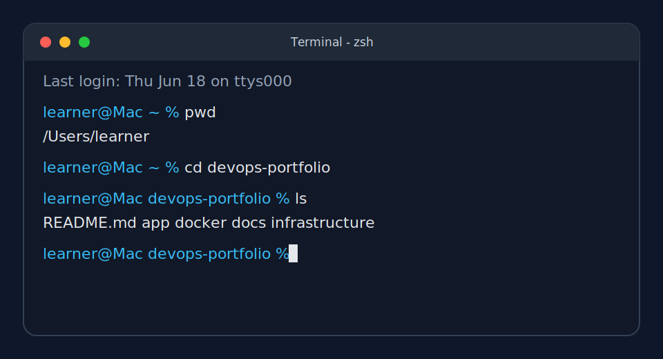
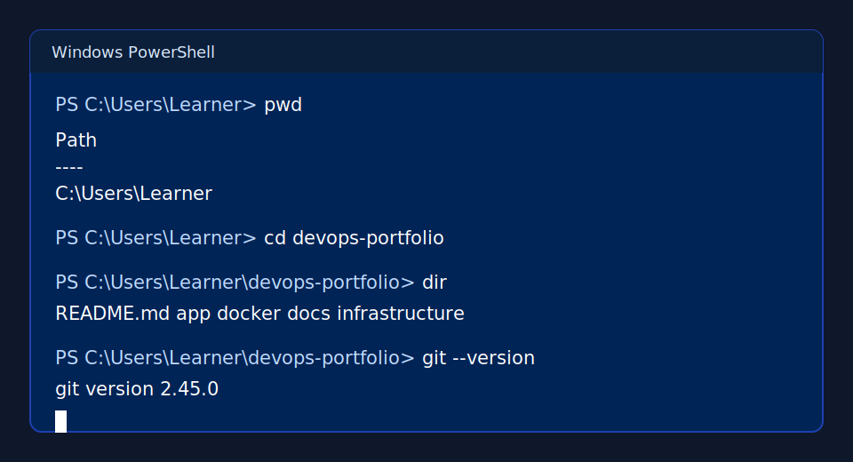
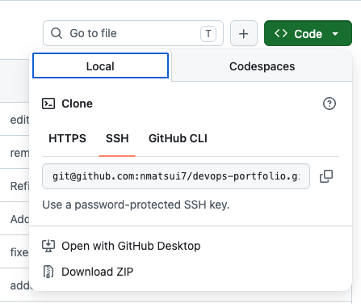
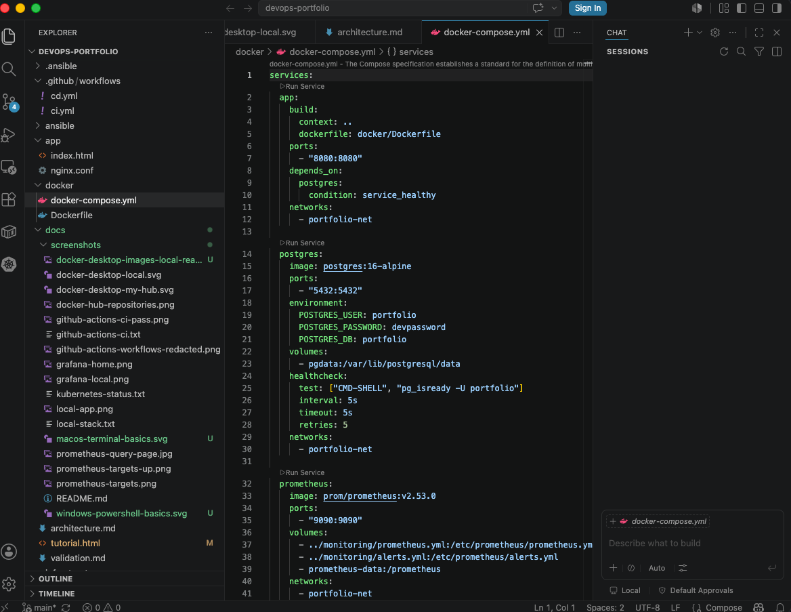

# How to Transfer This Repository to Your Computer

## Who this is for

This guide is for complete beginners who need to get the repository files onto
their own computer before starting the main DevOps tutorial. You do not need
coding, Git, terminal, or DevOps experience to follow this guide.

The goal is simple: put the project files into one folder on your computer, then
open that folder in Visual Studio Code.

You can open this Markdown file in any text editor or in VS Code. For complete
beginners, it is often easiest to read on the GitHub website in a browser because
GitHub displays the headings, lists, links, images, and command boxes in a clean
format. If you open this `.md` file directly in a text editor or VS Code, you may
see the raw Markdown formatting.

If you are reading this file in VS Code, you may see lines such as
````text
```sh
cd Documents
```
````

Those backtick lines are Markdown formatting. They create a command box when the
file is previewed. Do not type the backticks or the word `sh`. Type only the
command inside the box, such as `cd Documents`.

## What you will do

In plain English, you will:

1. Open a terminal.
2. Move to the Documents folder.
3. Create a folder called `devops_tutorial`.
4. Move into that folder.
5. Copy or place the repository files there.
6. Confirm the expected folders and files are visible.
7. Optionally install or check Git.
8. Open `docs/tutorial.html` in your browser.

## Before you start

You need:

- A computer running macOS or Windows.
- The repository files, either from a ZIP download, GitHub, or a folder provided
  by someone else.
- A web browser such as Chrome, Edge, Firefox, or Safari.

This guide does not assume you know Git yet. If you use the ZIP option, Git is
not needed to copy the files. Git is useful later in the main tutorial, but you
can open `tutorial.html` first and install Git later if needed. The main tutorial
also explains how to install VS Code, so you do not need VS Code before opening
`tutorial.html`.

## Step 1: Open a terminal

A terminal is the text-based place where you run commands. On macOS, the terminal
app is usually called Terminal. On Windows, the beginner-friendly terminal is
usually PowerShell.

### macOS

1. Press `Command + Space`.
2. Type `Terminal`.
3. Press `Enter`.



### Windows

1. Open the Start menu.
2. Type `PowerShell`.
3. Press `Enter`.



## Step 2: Go to your Documents folder

Run this command:

```sh
cd Documents
```

`cd` means "change directory." A directory is a folder. This command moves your
terminal into the Documents folder, where you will create the project folder.

If that command fails, try one of these:

- macOS:

  ```sh
  cd ~/Documents
  ```

- Windows PowerShell:

  ```powershell
  cd $HOME\Documents
  ```

## Step 3: Create the project folder

Run this command:

```sh
mkdir devops_tutorial
```

`mkdir` means "make directory," which means "create a folder." This creates a
folder named `devops_tutorial` inside your Documents folder.

## Step 4: Move into the project folder

Run this command:

```sh
cd devops_tutorial
```

Your terminal is now inside the `devops_tutorial` folder. The files you copy or
download next should go into this folder.

## Step 5: Put the repository files into this folder

Use one of the options below.

### Option A: If you downloaded a ZIP file

To download the repository ZIP file from GitHub in your browser:

1. Open the repository page on GitHub.
2. Click the green <strong>Code</strong> button near the top of the file list.
3. Click <strong>Download ZIP</strong>.
4. Wait for the ZIP file to download.
5. Open your Downloads folder.
6. Double-click the ZIP file to unzip it.
7. Open the unzipped folder.
8. Select all files and folders inside it.
9. Copy them into the `devops_tutorial` folder you created.



In the GitHub <strong>Code</strong> menu, <strong>Download ZIP</strong> is near
the bottom. The clone tabs such as HTTPS, SSH, and GitHub CLI are for Git-based
downloads. Beginners can use <strong>Download ZIP</strong> first.

On macOS, unzipping usually creates a normal folder automatically. On Windows,
you may need to right-click the ZIP file and choose <strong>Extract All</strong>,
then open the extracted folder.

Do not accidentally create a nested folder like this:

```text
Documents/devops_tutorial/devops-tutorial-main/app
```

The goal is for the main project folders to be directly inside
`devops_tutorial`, like this:

```text
Documents/devops_tutorial/app
Documents/devops_tutorial/docker
Documents/devops_tutorial/docs
```

### Option B: If you are using Git

This is optional. Use this path only if Git is already installed and you have the
repository URL. If Git is not installed yet, use Option A or jump to the optional
Git install step below first.

```sh
git clone <repository-url> .
```

What this means:

- `git clone` downloads the repository.
- `<repository-url>` should be replaced with the real GitHub URL.
- The final `.` means "put the files into the current folder."

Example shape:

```sh
git clone https://github.com/YOUR_USER/YOUR_REPOSITORY.git .
```

Do not make Git your default transfer path if you are not ready for it yet. The
ZIP option is fine for beginners.

## Step 6: Check that the files are there

On macOS or Linux-style terminals, run:

```sh
ls
```

On Windows PowerShell, you can also run:

```powershell
dir
```

You should see folders and files such as:

```text
app
docker
docs
infrastructure
monitoring
.github
README.md
docs/tutorial.html
```

Exact folder names may vary depending on the repository version. The important
thing is that folders like `app`, `docker`, and `docs` are directly inside
`devops_tutorial`.

## Step 7: Optional: Install or check Git

Git is a version control tool. It saves snapshots of project files, including
documents, configuration files, scripts, and application files.

If you used the ZIP download method, this step is optional. You can continue to
Step 8 and open the tutorial first. Install Git here only if you want to prepare
for the Git parts of the main tutorial now.

### Windows

Beginner path:

1. Go to [git-scm.com/install/windows](https://git-scm.com/install/windows).
2. Download Git for Windows.
3. Run the installer.
4. Accept the default choices.
5. Close and reopen PowerShell.

If you are using `winget`, you can install Git from PowerShell with:

```powershell
winget install --id Git.Git -e
```

### macOS

On macOS, open Terminal and run:

```sh
xcode-select --install
```

This installs Apple's command line tools, including Git. If macOS says the tools
are already installed, that is fine.

### Check that Git works

Run:

```sh
git --version
```

You should see something like:

```text
git version 2.40.0
```

The exact version number does not need to match. If your terminal prints a Git
version, Git is installed.

## Step 8: Open the main tutorial

Open the `docs` folder, then double-click `tutorial.html`.

Your browser should open the main tutorial page. This is where the full DevOps
lesson begins.

If double-clicking does not work:

1. Open your web browser.
2. Press `Command + O` on macOS or `Ctrl + O` on Windows.
3. Choose `Documents/devops_tutorial/docs/tutorial.html`.

The main tutorial includes the VS Code installation steps. After you install VS
Code there, you can open the whole project folder in VS Code.

Optional later step after VS Code is installed:

```sh
code .
```

`code` opens VS Code, and `.` means "this current folder."



## Step 9: Confirm you are ready for the main tutorial

Use this checklist:

- [ ] I can open Terminal or PowerShell.
- [ ] I created the `devops_tutorial` folder.
- [ ] I placed the repository files inside that folder.
- [ ] I can see folders like `app`, `docker`, and `docs`.
- [ ] Optional: I installed Git or confirmed `git --version` works.
- [ ] I opened `docs/tutorial.html` in my browser.
- [ ] I am ready to continue with the main tutorial.

## Common beginner mistakes

- Creating the project folder in the wrong location.
- Copying the outer ZIP folder instead of the files inside it.
- Ending up with a nested folder like
  `Documents/devops_tutorial/devops-tutorial-main/app`.
- Running commands from the wrong folder.
- Copying the terminal prompt symbol, such as `$`, `%`, or
  `PS C:\Users\...>`.
- Looking for VS Code too early. The main tutorial explains how to install and
  use VS Code after you open `docs/tutorial.html`.

## Quick mental model

Your final setup should look like this:

```text
Documents/
  devops_tutorial/
    app/
    docker/
    docs/
    infrastructure/
    monitoring/
    README.md
```

When you open `devops_tutorial` in VS Code, you are ready to start the main
tutorial.
