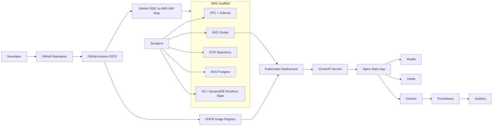

# Architecture

This tutorial demonstrates a small static Nginx application with a local runnable path and AWS infrastructure scaffolding. The cloud resources are intentionally documented as scaffold/demo pieces until they are applied in a real AWS account.



## Local Demo Path

```text
Docker Compose -> Nginx app -> /health, /ready, /metrics
               -> Prometheus -> Grafana
               -> Postgres placeholder for future app work
```

## AWS Scaffold Path

```text
Terraform -> VPC/private subnets -> EKS/RDS/ECR
GitHub Actions -> GHCR image -> EKS rolling deployment
```

## Boundaries

- The app is a static Nginx demo, not a Node.js or database-backed service.
- RDS and Postgres are included to demonstrate infrastructure design, not active application persistence.
- Ansible configures optional admin-node operational tooling and is not the EKS app deployment path.
